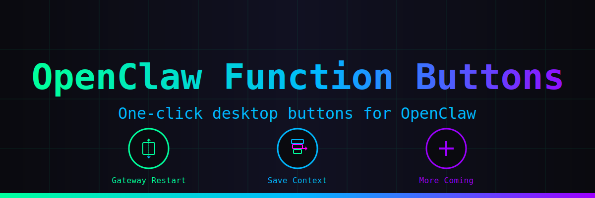

# OpenClaw Function Buttons



**One-click desktop buttons for OpenClaw - making AI assistance accessible to everyone**

## 🚀 Quick Start

### Installation (One Command!)

```bash
# Clone and install with one command
git clone https://github.com/[USERNAME]/openclaw-function-buttons.git
cd openclaw-function-buttons
./installer/one-command-setup.sh
```

That's it! Two desktop buttons will appear on your desktop:
- **Gateway Restart** - Restart OpenClaw gateway service
- **Save Context** - Save current conversation to memory

### Uninstallation

```bash
# Run the uninstaller
cd openclaw-function-buttons
./installer/uninstall.sh
```

## 📋 What You Get

### 🎯 Gateway Restart Button
- **One-click gateway restart** - Fixes connection issues instantly
- **Visual feedback** - Shows restart progress in terminal
- **Service management** - Uses systemd for reliable restarts
- **Error handling** - Catches and displays any issues

### 💾 Save Context Button  
- **Instant memory save** - Saves current conversation with one click
- **Timestamped entries** - Automatically adds date/time to memory
- **Clean formatting** - Organizes saved context for easy reading
- **Works anywhere** - Saves from any OpenClaw session

## 🖥️ How It Works

1. **Click the desktop button**
2. **Terminal opens** showing the action
3. **Action executes** with progress display
4. **Results shown** in terminal
5. **Close terminal** when done

No terminal commands to remember, no configuration needed.

## 🛠️ For Advanced Users

### Manual Installation
```bash
# Copy buttons to your preferred location
cp -r buttons/ ~/.local/share/openclaw-buttons/

# Create desktop entries manually
cp installer/*.desktop ~/.local/share/applications/
```

### Customization
Edit the button scripts in `buttons/` to:
- Change command behavior
- Add custom actions
- Modify output formatting

### Creating New Buttons
1. Copy `buttons/template.sh` to a new file
2. Edit the script with your OpenClaw command
3. Run the installer to add it to desktop

## 📁 Project Structure

```
openclaw-function-buttons/
├── buttons/                    # Button scripts
│   ├── gateway-restart.sh     # Restart gateway service
│   ├── save-context.sh        # Save conversation to memory
│   └── template.sh            # Template for new buttons
├── icons/                     # Button icons
│   ├── gateway-restart.svg    # Gateway restart icon
│   └── save-context.svg       # Save context icon
├── installer/                 # Installation scripts
│   ├── one-command-setup.sh   # Main installer
│   └── uninstall.sh           # Clean removal
├── docs/                      # Documentation
│   └── PROJECT_PLAN.md        # Development roadmap
├── logo.svg                   # Project logo
├── banner.svg                 # Project banner
└── README.md                  # This file
```

## 🤝 Contributing

Want to add more buttons? Here's how:

1. **Fork the repository**
2. **Create a new button script** in `buttons/`
3. **Design an icon** in `icons/`
4. **Test it works** with `./test-buttons.sh`
5. **Submit a pull request**

Check `docs/PROJECT_PLAN.md` for planned features and ideas.

## 📄 License

MIT License - see [LICENSE](LICENSE) file for details.

## ⚠️ Requirements

- **OpenClaw** installed and configured
- **Linux desktop** with .desktop file support
- **Bash shell** available
- **Systemd** for service management (gateway restart)

## 🔗 Links

- **OpenClaw Documentation**: https://docs.openclaw.ai
- **OpenClaw Community**: https://discord.com/invite/clawd
- **Report Issues**: GitHub Issues

---

**Made with ❤️ for the OpenClaw community**

*Simplify your OpenClaw workflow with one-click buttons*
